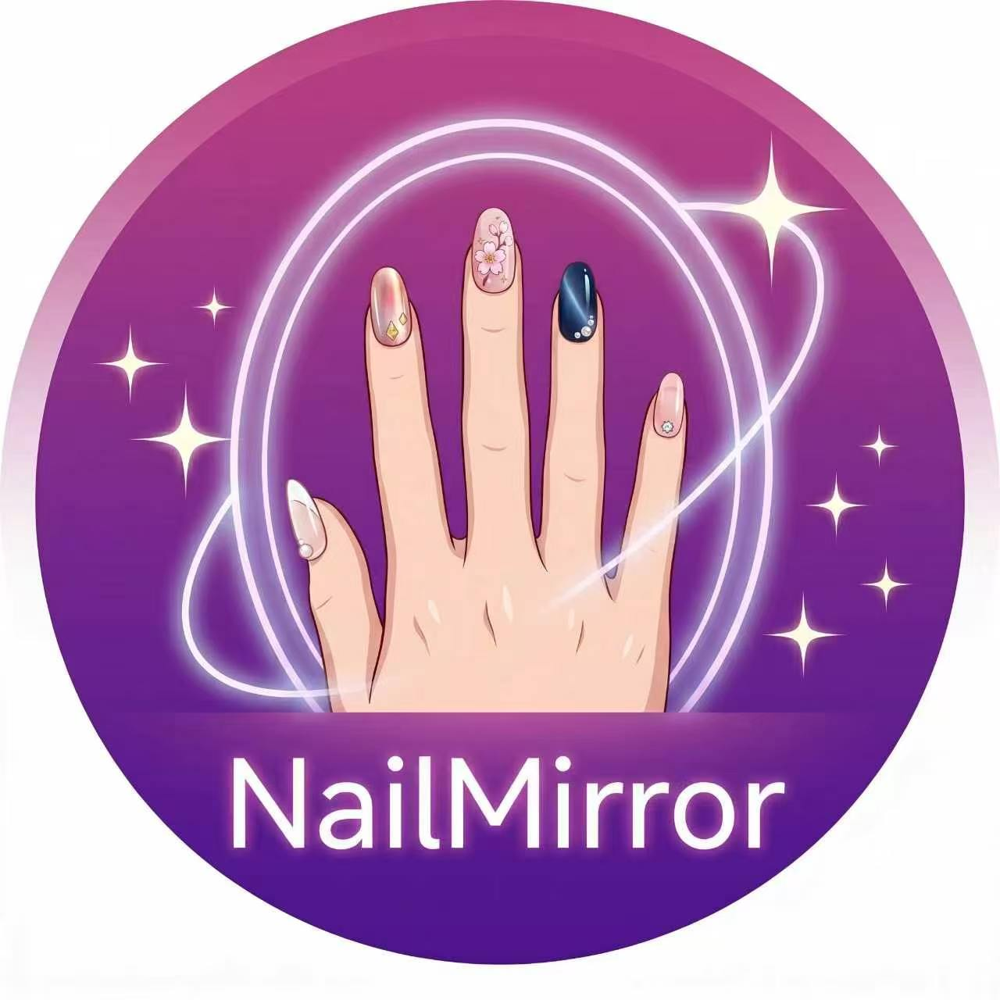
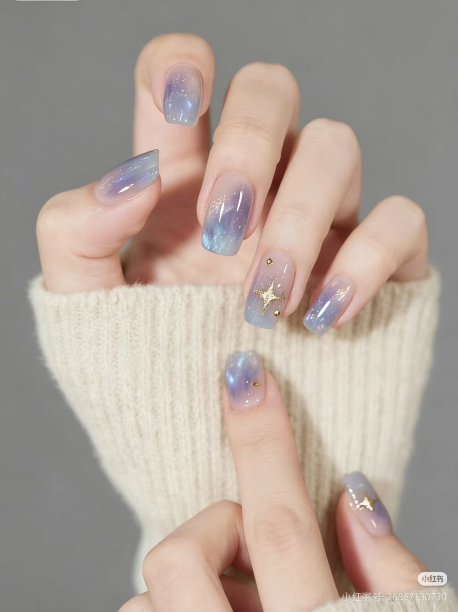
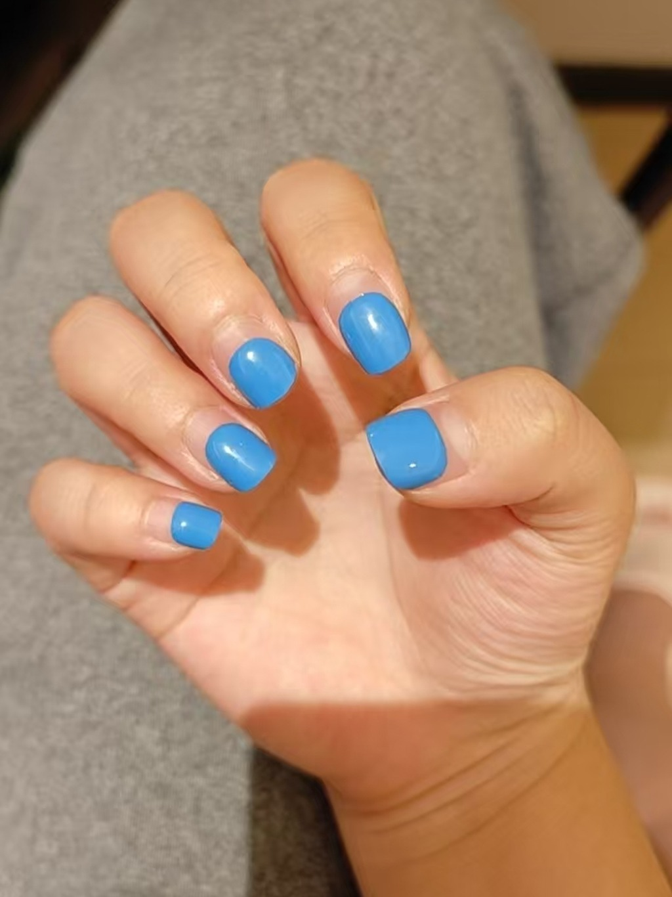
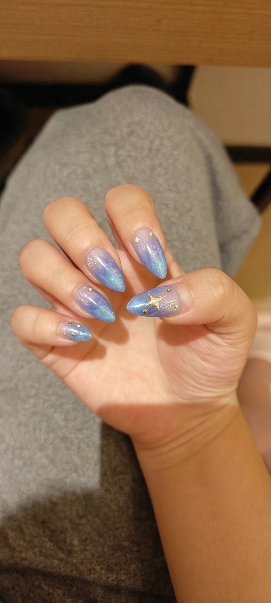
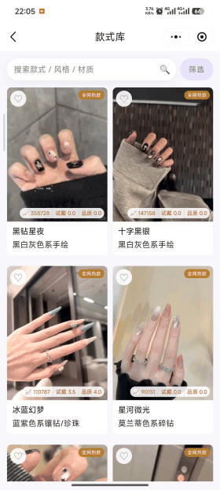
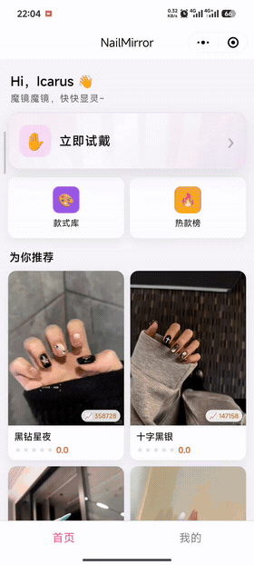
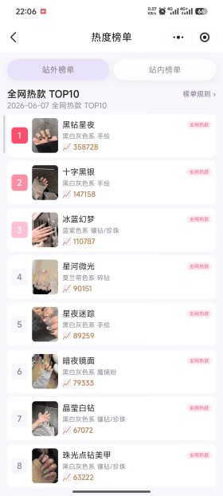
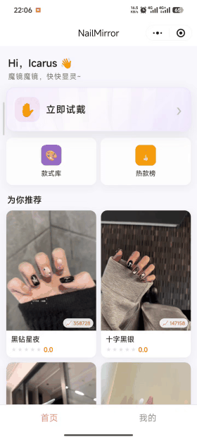
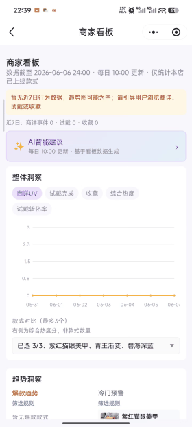

# NailMirror

**美甲 AI 试戴 · 智能款式运营 · 微信小程序**

*上传手照，秒看效果。平台精选、商家原创、小红书全网热款，一站试戴。*

 

 

[**GitHub 仓库**](https://github.com/Icarus-2001/NailMirror) · [**试戴效果**](#试戴效果) · [**产品演示**](#产品演示) · [**English**](./README.en.md)

---

## 这是什么

**NailMirror** 是一款面向 C 端用户与 B 端美甲商家的微信小程序：把手部照片与款式参考图融合，生成逼真的试戴效果；同时提供款式库、热度榜单、商家运营等完整链路。

| 面向 | 能力 |
|------|------|
| **消费者** | AI 云试戴 · 50+ 真实款式（每日更新）· 小红书全网热款 · 筛选排序 · 收藏与高清出片 |
| **商家** | 身份认证 · 款式库管理（查看 / 上传 / 下架）· 店铺信息配置 · 日更数据看板 · 运营策略 |

---

## 试戴效果

> 参考款式 + 真实手照 → AI 合成试戴。只改指甲，保留手部与背景。

<table>
<tr>
<td align="center" width="33%">
<strong>参考款式</strong>  
 
小红书热款 · 梦幻星河
</td>
<td align="center" width="33%">
<strong>试戴前</strong>  
 
用户真实手照
</td>
<td align="center" width="33%">
<strong>试戴后</strong>  
 
AI 合成输出
</td>
</tr>
</table>

---

## 核心亮点

<table>
<tr>
<td width="25%" align="center"><h3>AI 云试戴</h3>四步完成：选甲型 → 选款式 → 选手照 → 预览评分 万相 2.7 Pro · 评测手照 / 相册 / Mock 调试</td>
<td width="25%" align="center"><h3>丰富款式库</h3>50+ 真实款式 · 每日更新 平台特供 · 商家上传 · 全网热款 · 八大色系筛选</td>
<td width="25%" align="center"><h3>双轨热榜</h3>站内平台热度 + 站外小红书 TOP10 「全网热款」独立徽章与封面</td>
<td width="25%" align="center"><h3>商家运营</h3>款式库三 Tab · 日更数据看板 AI 运营策略 · 店铺信息配置</td>
</tr>
</table>

---

## 产品演示

> 以下为真机录屏动图预览。

### 款式库展示

C 端款式库：筛选抽屉、来源三标签（平台 / 商家 / 全网热款）、热度与时间排序、卡片浏览。

### 试戴流程

从首页进入试戴：选甲型 → 选款式（支持相册上传参考图）→ 选手照 → AI 合成 → 预览与评分。

### 站内 · 站外热度榜单

热度榜单页：平台款式热度排行 + 小红书「全网热款」TOP10，双榜并列展示。

### 商家 · 款式库管理

商家中心 → 款式库管理三 Tab：查看款式 / 上传款式 / 下架与删除。

### 商家看板

商家日更数据看板：核心指标、趋势洞察、标签聚合与 AI 运营策略建议。

---

**NailMirror** — 让每一次选款，都能先看见效果。

 

[GitHub](https://github.com/Icarus-2001/NailMirror) · [English](./README.en.md) · [License](./LICENSE)

