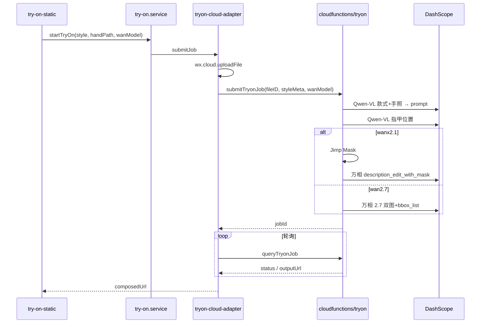

# 架构说明（当前 MVP）

## 1. 分层

```
Pages → Services → Adapters → 云函数 / Mock
                ↘ style.service → mock/styles.real.js
```

- **Pages**：UI 与页面状态
- **Services**：业务编排（`try-on.service.js`、`style.service.js`）
- **Adapters**：可替换实现（`tryon-cloud-adapter` / `tryon-mock-adapter`）
- **云函数**：敏感逻辑与 DashScope 调用

## 2. 试戴数据流



## 3. 云函数 `tryon` 动作

| action | 用途 |
|--------|------|
| `ping` | 健康检查（Key、模型名、runtime） |
| `analyzeNails` | 仅 VL 定位指甲（调试） |
| `submitTryonJob` | 提交试戴任务 |
| `queryTryonJob` | 查询万相任务状态 |

Handler 标识：`handler-v7-wan27-dual`

### submitTryonJob 处理步骤

1. 从云存储取手照 URL；读取 `event.wanModel` 或 env 决定后端
2. **Inpaint Prompt**：Qwen-VL 双图/单图分析
3. **指甲定位**：Qwen-VL 归一化椭圆
4. **万相**：
   - `wanx2.1-imageedit`：Jimp Mask → `description_edit_with_mask`
   - `wan2.7-image-pro`：款式图 + 手照 + `bbox_list`（指甲合并≤2框）→ 异步 `image-generation/generation`
5. 轮询 `/api/v1/tasks/{jobId}`，返回 `outputUrl` 与 `wanModel`

## 4. 前端 Adapter 切换

`services/try-on.service.js` 读取 `feature-flags.js`：

- `USE_CLOUD_TRYON === true` → `tryon-cloud-adapter.js`
- 否则 → `tryon-mock-adapter.js`（本地占位图）
- `SHOW_WAN_MODEL_PICKER === true` → 试戴页下拉 `wanModel` 传给云函数（覆盖 env）

## 5. 款式数据

- 源：`data/美甲款式数据（初稿版）.xlsx`
- 生成：`mock/styles.real.js`（25 条）
- 消费：`style.service.js` → 款式库、详情、首页、热榜

字段映射见 [DATA_SCHEMA.md](./DATA_SCHEMA.md)。

## 6. Mock 手照

| 来源 | 文件 |
|------|------|
| 默认单张 | `config/mock-hand.js` + `data/手型.jpg` |
| 13 张评测集 | `mock/eval-hands.js`（由 `scripts/import-eval-hands.js` 生成） |

试戴页 `USE_MOCK_HAND_PHOTO` 为 true 时展示选择器，无需相册权限。

## 7. 隐私授权

- `app.js`：`wx.onNeedPrivacyAuthorization` → `registerPrivacyPopup`
- 组件：`components/privacy-popup`
- 挂载页：`pages/home`、`pages/try-on-static`

## 8. 仍为 Mock 的模块

| 模块 | Adapter / 数据 |
|------|----------------|
| 商家入驻 / 套餐 | `merchant-mock-adapter` |
| 预约 / 订单 | `booking-mock-adapter` |
| 爬虫监控 | `crawler-mock-adapter` |
| AI 同款 | `ai-match-mock-adapter` |

## 9. 云函数依赖

`cloudfunctions/tryon/package.json`：

- `wx-server-sdk`
- `jimp`（Mask 绘制）

部署时使用微信开发者工具 **云端安装依赖**，勿本地打包 `node_modules`。

## 10. 扩展方向（未实现）

- 更精准指甲分割（SAM / 专用模型）
- 万相或 ComfyUI 款式 reference img2img
- 真实商家 / 预约后端
- AR 试戴页面接入 app.json
