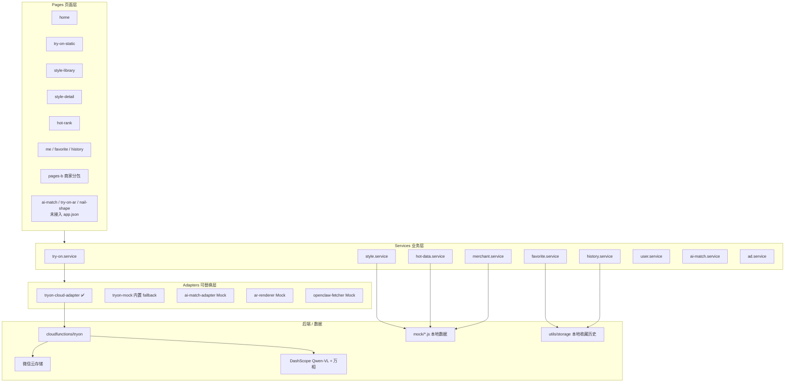
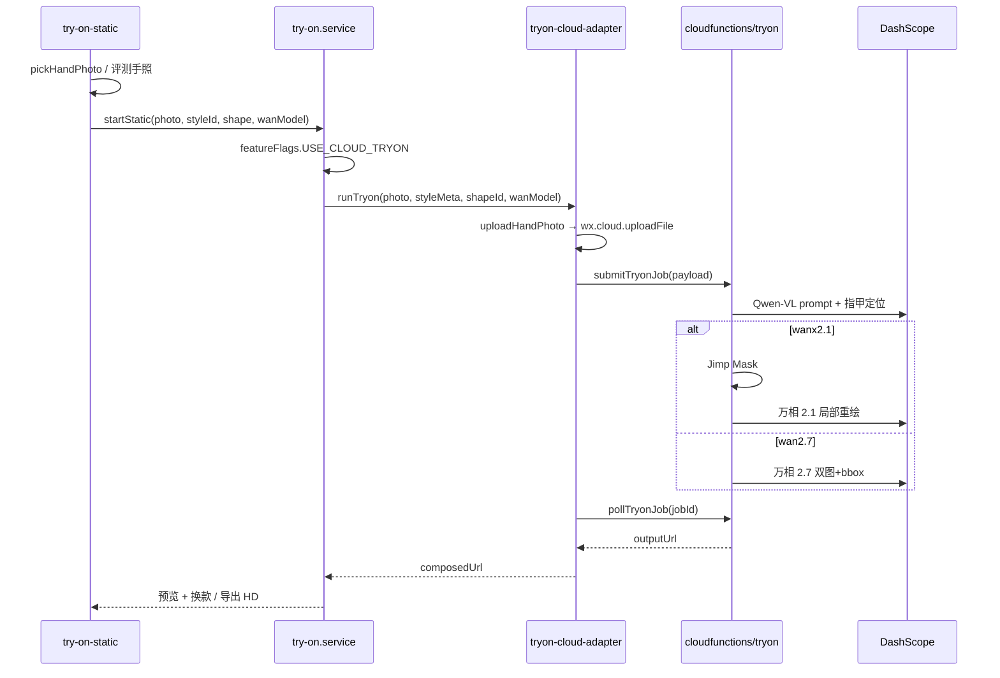
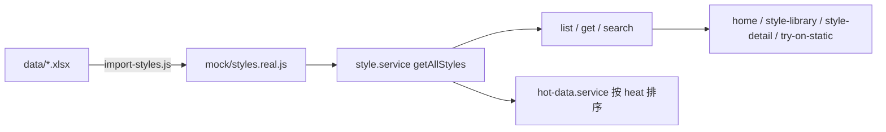
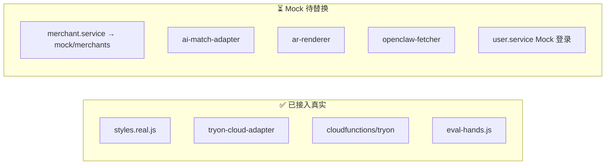

# NailMirror 代码图谱（CodeGraph）

> 由 [CodeGraph](https://github.com/codegraph-dev/codegraph) 自动索引生成，便于 AI 与开发者快速定位模块、调用链与改动影响面。  
> **索引时间**：首次 `codegraph index` · **114 文件 · 725 节点 · 1591 边**

---

## 1. 如何刷新索引

代码变更后，在项目根目录执行：

```bash
codegraph sync          # 增量同步（推荐，约 1 秒延迟）
codegraph index         # 全量重建
codegraph status        # 查看节点数 / 待同步文件
```

在 Cursor 中可直接让 AI 调用 MCP 工具：`codegraph_search`、`codegraph_context`、`codegraph_trace`、`codegraph_impact` 等。

---

## 2. 分层架构



---

## 3. 页面 → Service 依赖图

| 页面 | 路径 | 依赖 Service |
|------|------|--------------|
| 首页 | `pages/home` | `style.service`, `hot-data.service` |
| 款式库 | `pages/style-library` | `style.service` |
| 款式详情 | `pages/style-detail` | `style.service`, `favorite.service`, `merchant.service` |
| **静态试戴** | `pages/try-on-static` | `try-on.service`, `style.service`, `history.service` |
| 热款榜 | `pages/hot-rank` | `hot-data.service` |
| 高清出片 | `pages/hd-output` | `try-on.service`, `ad.service` |
| 登录 | `pages/login` | `user.service` |
| 我的 / 收藏 / 历史 | `pages/me*` | `history.service`, `favorite.service` |
| AI 同款 | `pages/ai-match` | `ai-match.service`, `favorite.service` |
| AR 试戴 | `pages/try-on-ar` | `try-on.service`, `style.service`, `history.service` |
| 商家看板 / 热榜 | `pages-b/dashboard`, `pages-b/hot-rank` | `hot-data.service` |
| 商家联系配置 | `pages-b/contact-config` | `merchant.service` |

**Store（跨页状态）**

| Store | 文件 | 用途 |
|-------|------|------|
| `tryOnStore` | `stores/try-on.store.js` | 当前款式 ID、甲型 |
| `userStore` | `stores/user.store.js` | openid、昵称、会员 |
| `favoriteStore` | `stores/favorite.store.js` | 收藏列表 |

---

## 4. 核心链路：云试戴（真实能力）



**关键符号（CodeGraph 可查）**

| 符号 | 文件 | 职责 |
|------|------|------|
| `onCompose` | `pages/try-on-static/index.js` | 触发合成 |
| `startStatic` | `services/try-on.service.js:23` | 按 flag 选云/Mock |
| `runTryon` | `services/adapters/tryon-cloud-adapter.js:50` | 上传+提交+轮询 |
| `submitTryonJob` | `cloudfunctions/tryon/handler.js:438` | 云函数编排 v7 |
| `wan-backends.js` | `cloudfunctions/tryon/` | 万相 2.1 / 2.7 双后端 |

**改动影响面**（`codegraph impact submitTryonJob`）：

- 前端：`tryon-cloud-adapter.js` → `runTryon` / `pollTryonJob`
- 云端：`handler.js` → `handle` 入口

---

## 5. 款式数据流



| 开关 | 文件 | 效果 |
|------|------|------|
| `USE_REAL_STYLES` | `config/feature-flags.js` | `true` → `styles.real.js`（25 条） |
| `USE_CLOUD_TRYON` | 同上 | `true` → 云试戴 |
| `USE_MOCK_HAND_PHOTO` | 同上 | 显示评测手照列表 |
| `SHOW_WAN_MODEL_PICKER` | 同上 | 万相 2.1/2.7 下拉 |

**引用 `featureFlags` 的文件**（改开关时注意）：  
`home`, `try-on-static`, `style-library`, `style.service`, `hot-data.service`, `try-on.service`, `favorite.service`, `ad.service`, `ar-renderer`, `request.js`

---

## 6. 真实 vs Mock 模块图



| 后续任务 | 优先改这里 | 不必改 Page |
|----------|------------|-------------|
| 接真实商家 API | 新建 `merchant-cloud-adapter.js`，改 `merchant.service` | 商家分包 pages-b |
| 接真实预约 | 新建 booking adapter | — |
| 款式迁云数据库 | `style.service` 数据源 | 页面保持不变 |
| AI 同款 | 替换 `ai-match-adapter.js` | `pages/ai-match` |
| AR 试戴 | 替换 `ar-renderer.js` + 接入 app.json | `pages/try-on-ar` |

---

## 7. 云函数 `tryon` 内部结构

```
cloudfunctions/tryon/
├── index.js          → exports.main = handle
├── handler.js        → ping / analyzeNails / submitTryonJob / queryTryonJob
├── wan-backends.js   → 万相 2.1 Mask + 2.7 双图/bbox
└── package.json      → wx-server-sdk, jimp
```

**Handler 标识**：`handler-v7-wan27-dual`

---

## 8. 常见改动速查

| 我想… | 先看 / 改 |
|-------|-----------|
| 改试戴 UI 流程 | `pages/try-on-static/index.{js,wxml}` |
| 改拍照/相册逻辑 | `utils/image.js` + 试戴页 photo 步骤 |
| 改万相模型逻辑 | `wan-backends.js` + `feature-flags.js` |
| 改款式列表/筛选 | `style.service.js` + `mock/styles.real.js` |
| 重新导入 Excel 款式 | `scripts/import-styles.js` |
| 改热榜排序 | `hot-data.service.js` |
| 改隐私弹窗 | `components/privacy-popup` + `app.js` |
| 改云环境 ID | `config/cloud-env.js` |
| 改 DashScope Key | 云函数环境变量 `DASHSCOPE_API_KEY` |
| 评估改动影响 | Cursor 中 `codegraph impact <符号名>` |

---

## 9. 目录符号密度（Top 模块）

| 目录/文件 | 符号数 | 说明 |
|-----------|--------|------|
| `cloudfunctions/tryon/handler.js` | 43 | 试戴 AI 编排核心 |
| `cloudfunctions/tryon/wan-backends.js` | 22 | 万相双后端 |
| `pages/try-on-static/index.js` | 12 | 试戴页（步骤最多） |
| `services/style.service.js` | 11 | 款式 CRUD |
| `services/try-on.service.js` | 11 | 试戴入口 |
| `services/adapters/tryon-cloud-adapter.js` | 11 | 云试戴客户端 |
| `utils/image.js` | 11 | 选图/压缩/保存 |
| `utils/cloud.js` | 9 | 云开发初始化 |

---

## 10. 相关文档

- [ARCHITECTURE.md](./ARCHITECTURE.md) — 架构与 API 说明
- [DATA_SCHEMA.md](./DATA_SCHEMA.md) — 字段契约
- [PROJECT.md](./PROJECT.md) — 项目概述
- `.cursor/rules/codegraph.mdc` — Cursor AI 使用 CodeGraph 的规则
