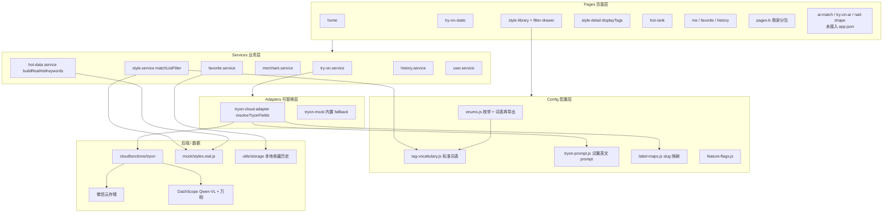
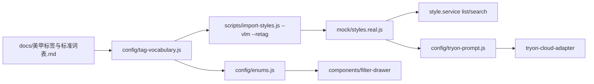
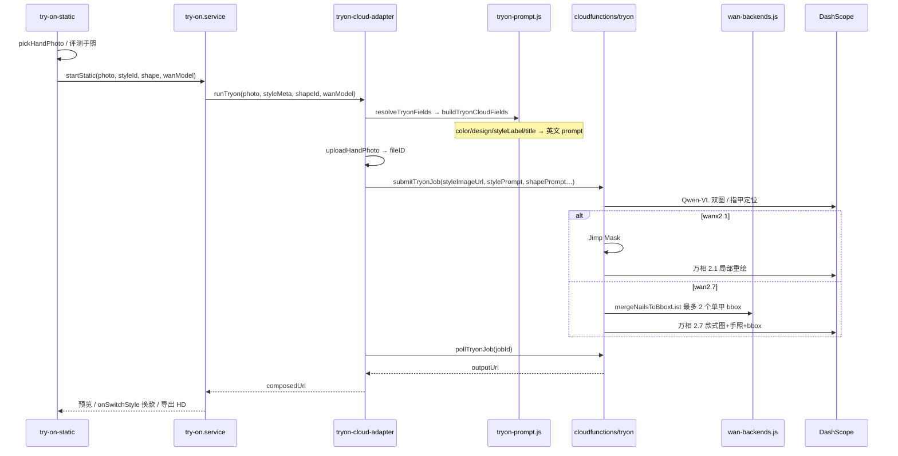
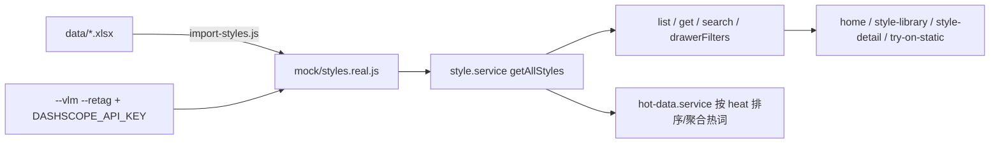
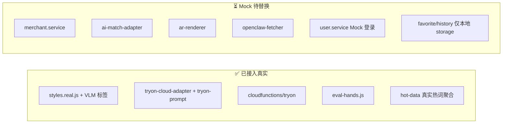

# NailMirror 代码图谱（CodeGraph）

> 由 [CodeGraph](https://github.com/codegraph-dev/codegraph) 自动索引生成，便于 AI 与开发者快速定位模块、调用链与改动影响面。  
> **最近全量索引**：2026-05-30 · `codegraph index` · **119 文件 · 764 节点 · 1,679 边** · DB ~2.13 MB

---

## 1. 如何刷新索引

代码变更后，在**项目根目录** `nailmirror-v1.6-20260519-r3/` 执行：

```bash
codegraph sync          # 增量同步（推荐，约 1 秒延迟）
codegraph index         # 全量重建
codegraph status        # 查看节点数 / 待同步文件
```

在 Cursor 中可直接让 AI 调用 MCP 工具：`codegraph_search`、`codegraph_context`、`codegraph_trace`、`codegraph_impact` 等（见 `.cursor/rules/codegraph.mdc`）。

**索引范围**：主要为 `nailmirror/src/` 下 JS（117）+ `scripts/*.py`（2）；不含 `cloudfunctions` 的 `node_modules`。

---

## 2. 分层架构



---

## 3. 页面 → Service 依赖图

| 页面 | 路径 | 依赖 Service / 组件 |
|------|------|---------------------|
| 首页 | `pages/home` | `style.service`, `hot-data.service`（`buildRealHotKeywords`） |
| 款式库 | `pages/style-library` | `style.service`, `components/filter-drawer` |
| 款式详情 | `pages/style-detail` | `style.service`, `favorite.service`, `merchant.service`, `displayTags` |
| **静态试戴** | `pages/try-on-static` | `try-on.service`, `style.service`, `history.service` |
| 热款榜 | `pages/hot-rank` | `hot-data.service` |
| 高清出片 | `pages/hd-output` | `try-on.service`, `ad.service`, `user.store` 额度 |
| 登录 | `pages/login` | `user.service` |
| 我的 / 收藏 / 历史 | `pages/me*` | `history.service`, `favorite.service`（`init` 主要在 me 页） |
| 商家看板 / 热榜 | `pages-b/dashboard`, `pages-b/hot-rank` | `hot-data.service` |
| 商家联系配置 | `pages-b/contact-config` | `merchant.service` |

**Store（跨页状态）**

| Store | 文件 | 用途 |
|-------|------|------|
| `tryOnStore` | `stores/try-on.store.js` | 当前款式 ID、甲型 |
| `userStore` | `stores/user.store.js` | openid、昵称、会员、HD 额度 |
| `favoriteStore` | `stores/favorite.store.js` | 收藏列表 |

---

## 4. 标签与筛选（0530 新增）



| 模块 | 职责 |
|------|------|
| `tag-vocabulary.js` | 8 色系 / 8 工艺 / 8 甲型 / 5 风格；`normalizeTag`、`buildVlmPrompt` |
| `label-maps.js` | 中文标签 → `styleTags` / `shapeTags` slug；`mapShapeCn` |
| `tryon-prompt.js` | VLM 展示标签 → 英文 `stylePrompt`；`buildTryonCloudFields` |
| `enums.js` | 甲型/风格枚举；**再导出词表**供 `filter-drawer`（组件勿直接 require `tag-vocabulary`） |
| `filter-drawer` | `useReal` 时四维度多选；WXML 内联 `wxs` 的 `includes` |
| `style.service` | `matchListFilter` 支持 `colors` / `designs` / `styleLabels` / `shapeLabels` |
| `hot-data.service` | `USE_REAL_STYLES` 时 `buildRealHotKeywords` 聚合热词 |

---

## 5. 核心链路：云试戴（真实能力）



**关键符号（CodeGraph 可查）**

| 符号 | 文件 | 职责 |
|------|------|------|
| `onCompose` | `pages/try-on-static/index.js` | 触发合成 |
| `onSwitchStyle` | 同上 | 换款重试（注意补 catch） |
| `startStatic` | `services/try-on.service.js` | 按 flag 选云/Mock |
| `resolveTryonFields` | `services/adapters/tryon-cloud-adapter.js` | 试戴 payload（与展示标签同源） |
| `buildTryonCloudFields` | `config/tryon-prompt.js` | 英文 prompt + shapePrompt |
| `submitTryonJob` | `cloudfunctions/tryon/handler.js` | 云函数编排 |
| `mergeNailsToBboxList` | `cloudfunctions/tryon/wan-backends.js` | 2.7：取面积最大的 2 甲框 |

**改动影响面**（`codegraph impact submitTryonJob` / `resolveTryonFields`）：

- 前端：`tryon-cloud-adapter.js` → `runTryon`；改 prompt 逻辑看 `tryon-prompt.js`
- 云端：`handler.js` → `wan-backends.js`（改 2.7 框选必部署云函数）

---

## 6. 款式数据流



| 开关 | 文件 | 效果 |
|------|------|------|
| `USE_REAL_STYLES` | `config/feature-flags.js` | `true` → `styles.real.js`（25 条） |
| `USE_CLOUD_TRYON` | 同上 | `true` → 云试戴 |
| `USE_MOCK_HAND_PHOTO` | 同上 | 显示评测手照列表 |
| `SHOW_WAN_MODEL_PICKER` | 同上 | 万相 2.1/2.7 下拉 |

---

## 7. 真实 vs Mock 模块图



| 后续任务 | 优先改这里 | 不必改 Page |
|----------|------------|-------------|
| 接 `ops` 云函数 | `pages-b/*` + 新建 adapter | 看板 UI |
| 款式/热榜迁云库 | `style.service` / `hot-data.service` | 列表页 |
| tryon 鉴权限流 | `handler.js` | 试戴页 |
| 收藏 lazy init | `favorite.service` | 详情/收藏页 |

---

## 8. 云函数 `tryon` 内部结构

```
cloudfunctions/tryon/
├── index.js          → exports.main = handle
├── handler.js        → ping / analyzeNails / submitTryonJob / queryTryonJob
├── wan-backends.js   → 万相 2.1 Mask + 2.7 双图/bbox（≤2 单甲框）
└── package.json      → wx-server-sdk, jimp
```

**Handler 标识**：`handler-v7-wan27-dual`

---

## 9. 常见改动速查

| 我想… | 先看 / 改 |
|-------|-----------|
| 改试戴 UI 流程 | `pages/try-on-static/index.{js,wxml}` |
| 改试戴英文 prompt | `config/tryon-prompt.js` + `tryon-cloud-adapter.js` |
| 改标准词表 / VLM 打标 | `docs/美甲标签与标准词表.md` → `tag-vocabulary.js` → `import-styles.js` |
| 改款式库筛选抽屉 | `components/filter-drawer` + `style.service` `matchListFilter` |
| 改列表/商详标签展示 | `style-card` / `style-detail` + `displayTags` |
| 改万相 2.7 指甲框 | `wan-backends.js` `mergeNailsToBboxList`（需部署云函数） |
| 改热榜/首页热词 | `hot-data.service.js` `buildRealHotKeywords` |
| 改拍照/相册逻辑 | `utils/image.js` + 试戴页 photo 步骤 |
| 改云环境 ID | `config/cloud-env.js` |
| 部署云函数 | 先选 `cloudfunctions` 云环境，再上传 `tryon` |
| 评估改动影响 | `codegraph impact <符号名>` |

---

## 10. 目录符号密度（Top 模块）

| 目录/文件 | 符号数（约） | 说明 |
|-----------|--------------|------|
| `cloudfunctions/tryon/handler.js` | 43+ | 试戴 AI 编排核心 |
| `cloudfunctions/tryon/wan-backends.js` | 22+ | 万相双后端 + bbox |
| `config/tag-vocabulary.js` | — | 标准词表（0530） |
| `config/tryon-prompt.js` | — | 试戴英文 prompt（0530） |
| `components/filter-drawer/index.js` | — | 真实款筛选 |
| `pages/try-on-static/index.js` | 12+ | 试戴页 |
| `services/style.service.js` | 11+ | 款式 CRUD + 抽屉筛选 |
| `services/adapters/tryon-cloud-adapter.js` | 11+ | 云试戴客户端 |
| `scripts/import-styles.js` | — | Excel / VLM 导入 |

---

## 11. 相关文档

- [ARCHITECTURE.md](./ARCHITECTURE.md) — 架构与 API 说明
- [DATA_SCHEMA.md](./DATA_SCHEMA.md) — 字段契约、试戴 prompt、云函数 API
- [美甲标签与标准词表.md](./美甲标签与标准词表.md) — 封闭标签
- [0530后优化建议codex.md](./0530后优化建议codex.md) — 静态审查待办
- [CHANGELOG.md](./CHANGELOG.md) — 迭代记录
- [PROJECT.md](./PROJECT.md) — 项目概述
- `.cursor/rules/codegraph.mdc` — Cursor AI 使用 CodeGraph 的规则
