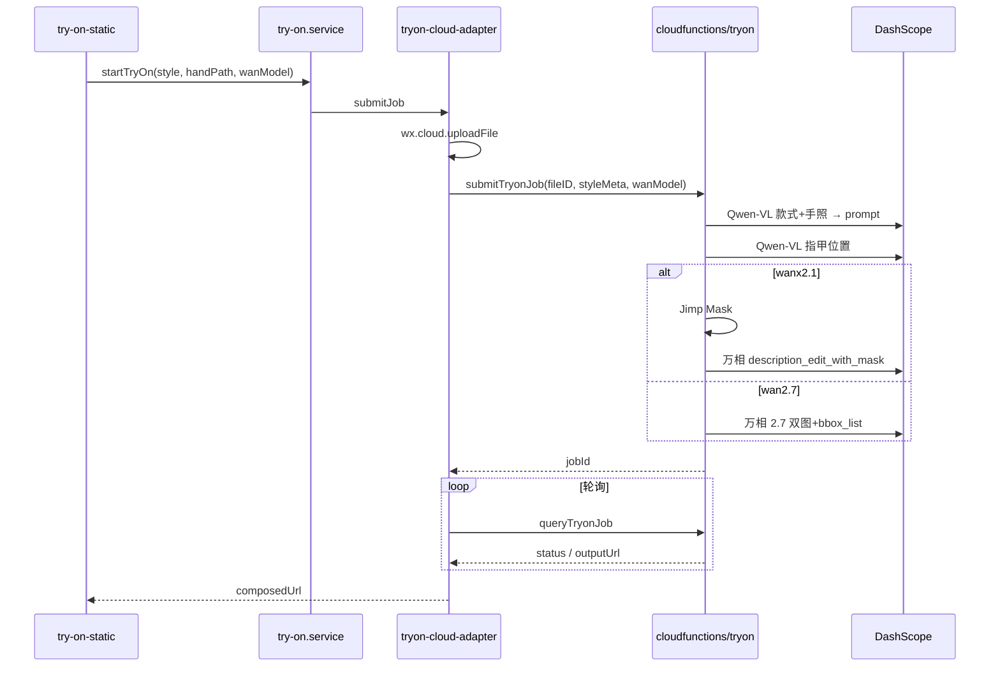
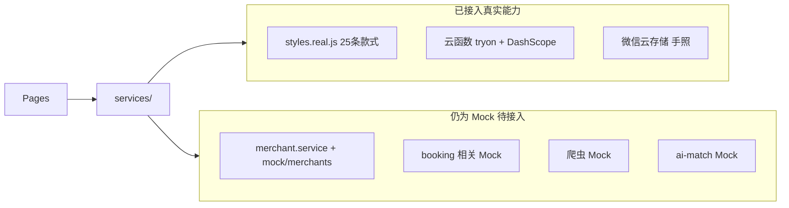

# NailMirror 队友接入说明

> 对照本文档，可在微信开发者工具中**复现当前云试戴 MVP 效果**，并了解后续接入真实后端的切入点。

---

## 1. 概述与目标

**NailMirror** 是美甲 AI 试戴 + 商家运营微信小程序。当前版本以「云试戴 MVP + 真实款式数据」为主：

| 能力 | 状态 |
|------|------|
| 25 条真实款式、热榜、收藏 | 已接入 |
| 云试戴（Qwen-VL + 万相 2.1/2.7） | 已接入 |
| 13 张评测手照（可跳过相册） | 已接入 |
| 商家 / 预约 / 订单 / 爬虫 / AI 同款 | Mock，待接入真实后端 |

**本文档目标：**

1. 加入团队小程序开发权限，导入项目并跑通试戴链路
2. 理解云函数与 DashScope 的配置方式
3. 对照验收清单确认环境与当前效果一致
4. 明确后续替换 Mock、接入真实后端的代码入口

### 试戴链路概览



---

## 2. 关键 ID 一览

以下配置与团队共用，**请勿自行修改**，除非负责人通知。

| 项 | 值 | 配置文件 |
|----|-----|----------|
| 小程序 AppID | `wxb5ec84f31303cfde` | `nailmirror/src/project.config.json` |
| 云开发环境 ID | `cloud1-d2g3df4y16873034b` | `nailmirror/src/config/cloud-env.js`（字段名 `ENV_ID`） |
| 云函数名称 | `tryon` | `nailmirror/src/cloudfunctions/tryon/` |
| 项目打开目录 | **`nailmirror/src/`** | 不是仓库根目录 |

---

## 3. 前置条件

- 微信账号（与负责人添加开发者时使用同一账号）
- Windows 或 Mac
- [微信开发者工具](https://developers.weixin.qq.com/miniprogram/dev/devtools/download.html)（稳定版）
- Node.js（可选，仅运行 `scripts/import-*.js` 重新导入 Excel 数据时需要）
- 由负责人将你添加为小程序**开发者**（见下一节）

---

## 4. 加入小程序开发团队

团队采用**共用 AppID + 共用云环境**模式，你需要被添加为项目开发者：

1. 负责人登录 [微信公众平台](https://mp.weixin.qq.com)
2. 进入 **成员管理** → **添加项目成员** → 角色选 **开发者**
3. 填写你的微信号，发送邀请
4. 你用微信扫码接受邀请
5. 微信开发者工具使用**同一微信**登录，导入项目时 AppID 自动可用

**注意：**

- **不要**改用测试号或自建 AppID，否则无法访问团队云环境
- **不要**新建云开发环境，使用下文已有的 `ENV_ID`

---

## 5. 导入项目与本地设置

### 5.1 获取代码

从负责人处获取代码仓库（克隆或压缩包解压均可）。

### 5.2 导入微信开发者工具

1. 打开微信开发者工具 → **导入项目**
2. 目录选择：**`nailmirror/src/`**（仓库内的此路径，不是根目录）
3. AppID 确认：`wxb5ec84f31303cfde`
4. 项目名称可填 `nailmirror`

### 5.3 本地设置

**详情 → 本地设置**，勾选：

- 「不校验合法域名、web-view（业务域名）、TLS 版本以及 HTTPS 证书」（开发阶段）
- 「启用云开发」

### 5.4 确认云环境 ID

打开 `nailmirror/src/config/cloud-env.js`，确认内容为：

```javascript
// 微信云开发环境 ID — 在微信开发者工具「云开发」面板复制后填入
module.exports = {
  ENV_ID: 'cloud1-d2g3df4y16873034b'
};
```

**无需新建云环境。** 若此处为空或 ID 不一致，请联系负责人。

---

## 6. 阿里云 DashScope（百炼）说明

试戴 AI 能力依赖阿里云 DashScope：

- **Qwen-VL**：分析款式图 + 手照，生成 inpaint prompt，定位指甲位置
- **万相 2.1**（`wanx2.1-imageedit`）：Mask 局部重绘，默认模型
- **万相 2.7**（`wan2.7-image-pro`）：双图 + bbox 框选，需百炼额外开通

### 6.1 团队 Key 模式

本项目采用**团队共用 API Key**，由负责人私下发放。

- **禁止**将 Key 写入代码或提交 git
- 你**无需**自行创建 Key，除非负责人另行安排
- Key 已配置在云函数环境变量中，你只需验证（见第 7 节 ping 测试）

### 6.2 阿里云注册概览（了解用）

若需了解计费或模型开通情况，可参考：

1. 访问 [阿里云百炼控制台](https://bailian.console.aliyun.com/) 或 [DashScope 控制台](https://dashscope.console.aliyun.com/)
2. 注册 / 登录阿里云账号 → 完成实名认证
3. 开通模型服务：**通义千问-VL（Qwen-VL）**、**万相（Wanx）**
4. 万相 2.7 需在百炼控制台单独开通；未开通时试戴页选 2.1 即可
5. 费用按 Qwen-VL 调用次数 + 万相生图张数计费，开发阶段建议设额度告警

### 6.3 Key 配置位置（负责人已配好）

微信开发者工具 → **云开发** → **云函数** → `tryon` → **配置** → **环境变量**：

| 变量 | 必填 | 说明 |
|------|------|------|
| `DASHSCOPE_API_KEY` | 是 | 团队 DashScope API Key（`sk-...`） |
| `WAN_IMAGE_MODEL` | 否 | 默认 `wanx2.1-imageedit` |
| `WANX_EDIT_MODEL` | 否 | 未设 `WAN_IMAGE_MODEL` 时生效 |
| `WAN_IMAGE_SIZE` | 否 | 2.7 输出尺寸，推荐 `2K` |
| `QWEN_VL_MODEL` | 否 | 默认 `qwen-vl-max` |

---

## 7. 云函数 `tryon` 部署与验证

### 7.1 何时需要部署

- 首次接入项目
- 云函数代码有更新（`cloudfunctions/tryon/` 目录变更）
- ping 测试失败或返回旧 runtime 标识

若负责人已部署且 ping 正常，可跳过部署直接验收。

### 7.2 部署步骤

1. 在微信开发者工具左侧文件树找到 `cloudfunctions/tryon`
2. 右键 → **上传并部署：云端安装依赖**（必须选此项）
3. **禁止**在 `cloudfunctions/tryon` 下本地执行 `npm install`（会导致上传包过大失败）
4. 确认 `cloudfunctions/tryon/node_modules` 不在 git 中、未被打包上传

### 7.3 云函数规格

见 `cloudfunctions/tryon/config.json`：

| 项 | 值 |
|----|-----|
| Runtime | Node.js 16 |
| 超时 | 120 秒 |
| 内存 | 512 MB |

依赖（云端安装）：`wx-server-sdk`、`jimp`

### 7.4 验证 ping

**云开发控制台 → 云函数 → tryon → 测试**，输入：

```json
{"action":"ping"}
```

**期望返回**（`data` 字段内）包含：

- `hasDashScopeKey: true`
- `runtime: "handler-v7-wan27-dual"`
- `supportedModels` 含 `wanx2.1-imageedit` 与 `wan2.7-image-pro`

若 `hasDashScopeKey: false`，联系负责人检查 `DASHSCOPE_API_KEY` 环境变量。

---

## 8. 功能开关与试戴流程

### 8.1 功能开关

编辑 `nailmirror/src/config/feature-flags.js`，复现 MVP 时使用以下值：

| 开关 | 推荐值 | 说明 |
|------|--------|------|
| `USE_REAL_STYLES` | `true` | 25 条真实款式（非 Mock 乱图） |
| `USE_CLOUD_TRYON` | `true` | 静态试戴走云函数 + DashScope |
| `USE_MOCK_HAND_PHOTO` | `true` | 显示评测手照快捷选择（与拍照/相册并存） |
| `SHOW_WAN_MODEL_PICKER` | `true` | 试戴页显示万相 2.1 / 2.7 下拉对比 |

修改后重新编译小程序。

### 8.2 试戴操作路径

1. 编译 → 首页 → **试戴** → 选一款 → **开始试戴**
2. 手照步骤（三选一或组合）：
   - 点 **「拍照」** 或 **「从相册选择」**（需隐私指引已发布，见 8.4）
   - 或在下方 **13 张评测手照 + 本地手型** 中任选一张
3. 上传步骤可选 **万相模型**（2.1 / 2.7），选择会保存到本地
4. 等待约 **30–90 秒**（2.7 可能更久）
5. 结果页显示 AI 合成图及本次使用的模型名

手照实际上传至微信云存储路径：`tryon/hands/{timestamp}.jpg`

### 8.3 万相模型对比

| 模型 | 路径 |
|------|------|
| `wanx2.1-imageedit` | Qwen-VL + Jimp Mask + 局部重绘 |
| `wan2.7-image-pro` | 款式图 + 手照 + bbox 框选指甲（需百炼开通 2.7） |

试戴页下拉选择会作为 `wanModel` 传给云函数，**覆盖** env 默认值，无需重新部署云函数。

### 8.4 隐私与相册

使用拍照/相册前：

1. [微信公众平台](https://mp.weixin.qq.com) → 开发 → 用户隐私保护指引 → 填写并发布
2. 需声明：**选中的照片或视频**、**摄像头**、**相册（仅写入）**、云开发相关能力
3. 审核通过后（约 1–3 工作日）删除小程序重新进入，试戴页会弹出隐私授权弹窗

隐私指引未通过审核时，拍照/相册会失败；可先用下方 **评测手照** 测试云试戴链路。

---

## 9. 验收清单

对照以下项逐项确认，全部通过即表示环境与当前效果一致：

- [ ] 云函数 ping 返回 `hasDashScopeKey: true`
- [ ] 首页「为你推荐」显示**美团 CDN 真实封面**（非 emoji 占位）
- [ ] 热款榜封面与款式名称一致
- [ ] 云试戴至少成功出图 **1 次**（2.1 或 2.7 均可）
- [ ] 款式库共 **25 条**、详情页、收藏功能正常
- [ ] 控制台无 `[tryon-cloud]` 致命错误

更详细的冒烟步骤见 [`nailmirror/src/tests/e2e-smoke.md`](../nailmirror/src/tests/e2e-smoke.md)。

---

## 10. 当前架构与后续接入真实后端

### 10.1 真实 vs Mock 一览



| 模块 | 当前实现 | 数据位置 |
|------|----------|----------|
| 款式库 / 详情 / 热榜 | 真实 | `mock/styles.real.js` |
| 静态试戴 | 真实（云函数） | `cloudfunctions/tryon/` |
| 收藏 / 历史 | 本地存储 | `utils/storage.js` |
| 商家入驻 / 套餐 | Mock | `services/merchant.service.js` + `mock/merchants.js` |
| 预约 / 订单 | Mock | 本地 Mock 数据 |
| AI 同款 / AR / 爬虫 | Mock | 页面部分未接入 `app.json` |

### 10.2 接入真实后端的推荐路径

1. **阅读架构文档**：[`docs/ARCHITECTURE.md`](./ARCHITECTURE.md) 中的 Adapter 分层设计

2. **优先替换 Service / Adapter 层**（不改 Page 层）：
   - 试戴：已有 `services/adapters/tryon-cloud-adapter.js`，稳定，暂不建议改动
   - 商家：从 `services/merchant.service.js` 抽离或新建 `merchant-cloud-adapter.js`，对接真实 API
   - 预约：同理，替换 Mock 延迟与本地 seed 数据

3. **款式数据迁移**：
   - 当前：本地 JS 文件 `mock/styles.real.js`（25 条）
   - 消费入口：`services/style.service.js`
   - 可迁移至微信云数据库或自建后端，字段契约见 [`docs/DATA_SCHEMA.md`](./DATA_SCHEMA.md)

4. **重新导入 Excel 数据**（负责人提供 `data/` 目录时）：

   ```bash
   cd nailmirror/src
   node scripts/import-styles.js
   node scripts/import-eval-hands.js
   ```

5. **试戴链路已稳定**，除非后端要统一任务调度，否则先不动云函数 `tryon`。

### 10.3 上线前域名配置

微信公众平台 → 开发 → 开发管理 → 服务器域名 → **downloadFile 合法域名**：

- `https://dashscope-result-bj.oss-cn-beijing.aliyuncs.com`（万相结果图）
- `https://p0.meituan.net`、`https://p1.meituan.net`（款式封面）

---

## 11. 常见问题

| 现象 | 处理 |
|------|------|
| 提示「云开发未就绪」 | 关闭游客模式；确认已开通云开发且 `ENV_ID` 正确 |
| `hasDashScopeKey: false` | 联系负责人检查云函数环境变量 `DASHSCOPE_API_KEY` |
| 云函数上传失败 / 包过大 | 删除 `cloudfunctions/tryon/node_modules`，用「云端安装依赖」重传 |
| `Model not exist`（2.7） | 百炼未开通 2.7 → 试戴页下拉改选 2.1 |
| 相册点不开 / 无隐私弹窗 | 隐私指引未审核通过；审核通过后删小程序重进；或先用评测手照 |
| 试戴几乎无变化 | 换光线清晰、五指可见的手照；查看云函数日志中 VL / 万相步骤 |
| 首页 / 热榜封面空白（真机） | CDN 须为 **https://**；配置 downloadFile 域名 `p0/p1.meituan.net` |
| 首页 / 热榜仍是乱图 | 确认 `USE_REAL_STYLES: true` 并重新编译 |
| 依赖分析报错 | 项目已移除 `utils/privacy.js`，改用 `components/privacy-popup` |

---

## 12. 相关文档

| 文档 | 用途 |
|------|------|
| [SETUP_USER.md](./SETUP_USER.md) | 部署与密钥配置清单 |
| [ARCHITECTURE.md](./ARCHITECTURE.md) | 试戴链路、云函数、分层架构 |
| [DATA_SCHEMA.md](./DATA_SCHEMA.md) | 款式字段、云函数 API |
| [CODEGRAPH.md](./CODEGRAPH.md) | 代码图谱、试戴链路、改动速查 |
| [PROJECT.md](./PROJECT.md) | 项目概述与目录结构 |
| [CHANGELOG.md](./CHANGELOG.md) | 迭代记录 |

---

## 13. 费用参考

- **微信云开发**：免费额度内通常够用（云函数 + 云存储）
- **DashScope**：按 Qwen-VL 调用次数 + 万相生图张数计费，开发阶段建议设额度提醒

如有问题，请联系项目负责人。
