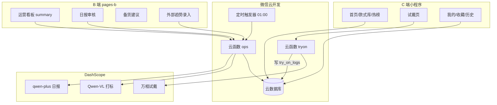

# NailMirror 后端及运营优化方案（0527）

> **截止日期：** 2026-06-06  
> **方案定位：** 以微信云开发为唯一后端，吸收 [智能运营层.md](./智能运营层.md) 的业务逻辑，放弃 FastAPI + PostgreSQL 独立栈，B 端复用现有 `pages-b/` 分包扩展。  
> **小程序代码根：** `nailmirror/src/` · **云环境：** `cloud1-d2g3df4y16873034b`

---

## 1. 背景与现状

### 1.1 当前已完成

| 能力 | 状态 |
|------|------|
| 25 条真实款式、热榜、收藏 | ✅ 静态 `mock/styles.real.js` |
| 云试戴（Qwen-VL + 万相 2.1/2.7） | ✅ 云函数 `tryon` |
| 13 张评测手照 | ✅ |
| B 端分包 UI 骨架 | ✅ `pages-b/dashboard` 等（数据为 Mock） |
| 2K 出图保存相册 | ✅ |

### 1.2 当前缺口

| 能力 | 现状 |
|------|------|
| 云数据库 | 未使用 |
| 试戴行为日志 | 无 |
| 动态权重排序 | C 端按静态 `heat`，`rankWeight` 未参与排序 |
| 外部趋势 / 爬虫 | Mock（`openclaw-fetcher`、首页硬编码热词） |
| 运营日报 / 调权 | 未实现 |
| 收藏 / 历史 | 本地 `wx.storage` |

### 1.3 智能运营层文档 vs 本方案

[智能运营层.md](./智能运营层.md) 设计了 FastAPI + PostgreSQL + APScheduler + 独立爬虫 + React B 端的完整闭环。本方案**保留其业务逻辑**（四信号 dashboard、三因子 scoring、日报 + 人工审核 + 调权审计），**替换技术栈**为微信云开发，以在 **6.6 前** 可交付。

---

## 2. 方案取舍（综合决策）

| 维度 | 原文档（智能运营层） | 本方案决策 |
|------|---------------------|-----------|
| 后端运行时 | FastAPI + PostgreSQL | **云函数 `tryon` + 新建 `ops`** |
| 数据库 | SQLite/PG 7 表 | **云数据库 6 collection** |
| 定时任务 | APScheduler | **云函数定时触发器**（每日 01:00） |
| B 端 UI | 独立 React | **扩展 `pages-b/` 分包** |
| 外部爬虫 | spider.py 全自动 | **半自动：运营录入 + VLM 打标脚本** |
| LLM 日报 | Moonshot | **DashScope qwen-plus**（复用已有 Key） |
| VLM 打标 | 独立 vlm.py | **复用 Qwen-VL**（`import-styles.js` 已有能力） |
| 权重执行 | 全自动 | **人工 approve → 写库**（6.5 后可开半自动） |
| 用户/收藏 | 完整 users + favorites | **try_on_logs 带 openid；收藏/历史上云（D6–D7）** |
| C 端排序 | rank_weight | **统一：`heat = rankWeight × 1000`** |

### 6.6 范围外（明确不做）

- 独立 FastAPI 服务
- 小红书/抖音全自动爬虫
- AR 试戴 / AI 同款页接入 `app.json`
- 真实商家预约订单、会员支付

---

## 3. 目标架构



---

## 4. 云数据库设计（6 Collection）

| Collection | 对应智能运营层 | 6.6 必做字段 |
|------------|---------------|-------------|
| `styles` | styles | id, title, color, design, shape, styleLabel, coverUrl, rankWeight, isActive, updatedAt |
| `try_on_logs` | try_on_logs | styleId, openid, triedAt, jobId（可选） |
| `external_trends` | external_trends | platform, postUrl, engagement, color, design, shape, postedAt, scrapedAt |
| `daily_reports` | daily_reports | reportDate, contentMd, strategyJson, status（pending/approved/rejected/executed） |
| `operation_logs` | operation_logs | reportId, styleId, weightBefore, weightAfter, source, executedAt |
| `users` | users + favorites | openid, nickname, avatarUrl, favoriteStyleIds[] |

### 权限规则

- C 端：**只读** `styles`
- `try_on_logs`：**仅云函数写**
- B 端写操作：全部走 `ops` 云函数，校验管理员 **openid 白名单**

### 字段统一约定

- 运营只维护 `rankWeight`（0.5–5.0）
- C 端展示：`heat = Math.round(rankWeight × 1000)`
- 内外部匹配仅用 **color / design / shape** 三字段（不用 style 风格标签做外部共振）

---

## 5. 云函数 `ops` 接口规划

| action | 说明 | 对应智能运营层 |
|--------|------|---------------|
| `getSummary` | 四信号：hot / trending / cold / external_hot | GET /api/dashboard/summary |
| `computeWeights` | 三因子 scoring，只计算不写库 | scoring.py |
| `generateReport` | scoring + LLM 日报 → daily_reports pending | POST /api/reports/generate |
| `approveReport` | pending → approved | B 端审核 |
| `rejectReport` | pending → rejected | B 端审核 |
| `executeReport` | 写 styles.rankWeight + operation_logs | executor.py |
| `tagExternal` | 单条外部趋势 VLM 打标入库 | tagger.py |
| `listReports` | 日报列表 | B 端 |
| `listOperationLogs` | 权重变更审计 | B 端 |

### scoring 三因子（与智能运营层一致）

| 因子 | 满分 | 数据来源 |
|------|------|---------|
| 内部热度分 | 2.5 | 近 7 天试戴量排名 |
| 内部动能分 | 1.5 | 近 3 天 vs 前 3 天 growth_rate |
| 外部共振分 | 1.0 | external_trends 与款式的 color/design 匹配 |

最终：`new_weight = min(max(热度 + 动能 + 共振, 0.5), 5.0)`

LLM **只写 Markdown 解读**，不产出数值；数值由 scoring 确定性计算。

---

## 6. 模块交付清单

### 6.1 后端（云函数 + 数据库）

| # | 模块 | 优先级 |
|---|------|--------|
| A1 | 云数据库 6 collection + 安全规则 | P0 |
| A2 | styles 种子导入（`import-styles.js --cloud`） | P0 |
| A3 | tryon：submitTryonJob 成功后写 try_on_logs | P0 |
| A4 | ops.getSummary | P0 |
| A5 | ops.computeWeights | P0 |
| A6 | ops.generateReport | P0 |
| A7 | ops.approve + execute + operation_logs | P0 |
| A8 | ops.tagExternal | P1 |
| A9 | 定时触发器（每日 01:00 generateReport） | P1 |
| A10 | users 登录（code2Session） | P1 |

### 6.2 C 端前端

| # | 页面/服务 | 现状 | 6.6 目标 |
|---|----------|------|---------|
| B1 | style.service | 读本地 JS，静态 heat | 读云库，按 rankWeight 排 |
| B2 | hot-data.service | 静态 heat 榜 | 云库 rankWeight + try_on_logs |
| B3 | home/index | 硬编码热词 | 读 external_trends 或 summary |
| B4 | history.service | 本地 storage | 上云 |
| B5 | favorite.store | 本地 storage | 同步 users.favoriteStyleIds |
| B6 | try-on-static | 已接云试戴 | 试戴完成写 history |
| B7 | me-history / me-favorite | UI 已有 | 接云数据 |
| B8 | hot-rank（C 端） | 静态 | 读 ops 热款/飙升 |

### 6.3 B 端运营（pages-b）

| # | 页面 | 现状 | 6.6 目标 |
|---|------|------|---------|
| C1 | dashboard | mock 热词 | 四信号运营看板 |
| C2 | reports（新增） | 无 | 日报列表、预览、approve/reject |
| C3 | weight-manage（新增） | 无 | operation_logs 历史 |
| C4 | stock-advice | 硬编码 | 由 cold_styles + LLM 生成可复制清单 |
| C5 | external-import（新增） | 无 | 运营录入 → VLM 打标 |
| C6 | hot-rank（B 端） | mock 曲线 | 接 external_trends |

### 6.4 运营内容（与开发并行）

| # | 内容 | 截止 |
|---|------|------|
| D1 | 25 款式云库核对（封面 HTTPS、标签） | D2 |
| D2 | external_trends 种子 **≥30 条** | D8 |
| D3 | 内部试戴压测 **≥200 次** | D9 |
| D4 | 首份运营日报审核话术模板 | D7 |
| D5 | B 端管理员 openid 白名单 | D3 |
| D6 | 演示脚本 + 验收截图 | D10 |

---

## 7. 10 天排期（5.27 → 6.6）

假设 **2 人并行**（1 云后端 + 1 小程序/运营 UI）。

### Phase 0：基建 + 行为数据（D1–D2，5.27–5.28）

| 天 | 后端 | 前端 | 运营 |
|----|------|------|------|
| D1 | 建 6 collection、安全规则；styles 导入上云 | `USE_CLOUD_OPS` feature-flag | 核对 25 款 Excel ↔ 云库 |
| D2 | tryon 写 try_on_logs；ops 骨架 + ping | style.service 双模式（云/本地 fallback） | 开始收集外部帖子链接 |

**里程碑 M0：** 试戴一次 → 云库有 log；款式可从云库读出。

### Phase 1：运营引擎核心（D3–D5，5.29–5.31）

| 天 | 后端 | 前端 | 运营 |
|----|------|------|------|
| D3 | ops.getSummary 四信号 | B dashboard 接 summary | 录入外部趋势 10 条 |
| D4 | ops.computeWeights + generateReport | 新增 reports 页 | 试戴压测 50 次 |
| D5 | ops.approve + execute + operation_logs | weight-manage 页；C 热榜接 rankWeight | 管理员白名单 |

**里程碑 M1：** 手动「生成日报」→ pending → approve → C 端排序变化。

### Phase 2：C/B 端全面接真数据（D6–D8，6.1–6.3）

| 天 | 后端 | 前端 | 运营 |
|----|------|------|------|
| D6 | ops.tagExternal；users 登录 | history/favorite 上云 | 外部趋势补到 20 条 |
| D7 | 定时触发器；home 热词接 external | stock-advice 接 cold_styles | 试戴累计 150 次 |
| D8 | scoring 联调 + 边界修复 | B hot-rank + external-import 页 | 外部趋势补到 30 条 |

**里程碑 M2：** 端到端闭环；B 端可录入外部情报；备货建议非硬编码。

### Phase 3：验收 + 演示（D9–D10，6.4–6.6）

| 天 | 全员 |
|----|------|
| D9 | 全链路回归；真机测 2K 保存；文档更新 |
| D10 (6.6) | 演示彩排；打 tag `v1.6-ops`；交付验收 |

**里程碑 M3：** 下方验收清单全部 ✅。

---

## 8. 人力分工

```
角色 A（云后端）              角色 B（小程序 + 运营 UI）
─────────────────            ─────────────────────────
D1-D2  云库 + tryon log       D1-D2 style.service 云适配
D3-D5  ops 全接口             D3-D5 pages-b 三页 + C 热榜
D6-D8  定时器 + tagExternal   D6-D8 history/fav + home + stock
D9-D10 联调 + 修 bug          D9-D10 UI polish + 真机

并行：运营填 external_trends + 试戴压测（不可省）
```

**1 人开发降级：** 收藏/历史上云延后；external_trends 减至 15 条；LLM 日报改为「模板 + 数据填充」。

---

## 9. 6.6 验收清单（Definition of Done）

### 后端

- [ ] 6 个 collection 存在且权限正确
- [ ] 试戴成功自动写 `try_on_logs`（含 openid、styleId、时间）
- [ ] `ops.getSummary` 返回 hot / trending / cold / external_hot
- [ ] `ops.generateReport` 幂等，产出 pending 日报 + strategyJson
- [ ] approve 后 `styles.rankWeight` 更新，`operation_logs` 有记录
- [ ] 定时任务每日自动生成 pending 日报

### C 端

- [ ] 首页 / 款式库 / 热榜按云库 rankWeight 排序
- [ ] 试戴 → 历史可见
- [ ] 调权后重启小程序，排序反映新权重

### B 端

- [ ] dashboard 展示四信号真实数据
- [ ] 日报可预览、approve/reject
- [ ] 权重变更历史可查看
- [ ] 外部趋势可录入并 VLM 打标
- [ ] 备货建议来自 cold_styles，可复制

### 运营内容

- [ ] external_trends ≥ 30 条（含 VLM 标签）
- [ ] try_on_logs ≥ 200 条
- [ ] 至少 3 份 daily_reports（含 1 份 executed）
- [ ] 演示脚本 15 分钟可讲完闭环

---

## 10. 风险与降级

| 风险 | 概率 | 降级方案 |
|------|------|---------|
| 试戴量不足，scoring 无差异 | 高 | D9 前人工 bulk 试戴；或 seed 测试 log |
| 外部数据不够 | 高 | 运营手工录入 30 条，不做 spider |
| LLM 日报质量不稳定 | 中 | 模板 + LLM 只写 3 条建议 |
| 收藏/历史上云来不及 | 中 | 保留本地 storage，仅 try_on_logs 上云 |
| 2 人不够 | 中 | 砍 B 端 hot-rank 趋势图，保留 dashboard 数字 |
| 云函数 LLM 超时 | 低 | generateReport 拆两步：先 scoring 写库，再调 LLM |

---

## 11. 代码衔接点

| 改动 | 文件 |
|------|------|
| 试戴写 log | `cloudfunctions/tryon/handler.js` |
| 新建运营云函数 | `cloudfunctions/ops/`（新建） |
| C 端读云库 | `services/style.service.js`、`services/hot-data.service.js` |
| B 端看板 | `pages-b/dashboard/index.js` |
| 新增 B 端页 | `pages-b/reports/`、`pages-b/external-import/`、`pages-b/weight-manage/` |
| 注册分包 | `app.json` subPackages |
| 款式上云 | `scripts/import-styles.js` 增 `--cloud` |
| 功能开关 | `config/feature-flags.js` 增 `USE_CLOUD_OPS` |

---

## 12. 相关文档

| 文档 | 用途 |
|------|------|
| [智能运营层.md](./智能运营层.md) | 原始业务逻辑与 scoring 公式 |
| [GITHUB_COLLABORATION.md](./GITHUB_COLLABORATION.md) | 队友协作与 PR 流程 |
| [TEAMMATE_ONBOARDING.md](./TEAMMATE_ONBOARDING.md) | 环境配置与验收 |
| [ARCHITECTURE.md](./ARCHITECTURE.md) | 试戴链路与分层 |
| [DATA_SCHEMA.md](./DATA_SCHEMA.md) | 款式字段与云函数 API |

---

## 13. 结论

**6.6 可交付的完整方案 = 微信云一体化运营闭环：**

1. **保留** 智能运营层的业务逻辑（感知 → 分析 → 策略 → 执行 → C 端更新）
2. **替换** 技术栈为云数据库 + 云函数 + 小程序 B 端
3. **降级** 全自动爬虫为运营手工录入 + VLM 打标
4. **并行** 运营内容（30 条外部趋势 + 200 次试戴）与开发同等重要

2 人 10 天可完成核心闭环；1 人需接受部分功能延后，但试戴→统计→日报→调权→C 端更新仍可在 6.6 前交付。
